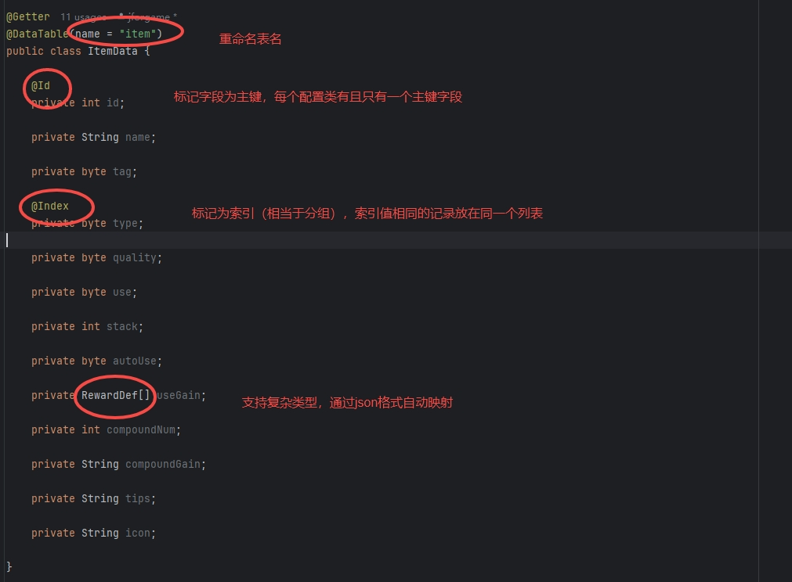
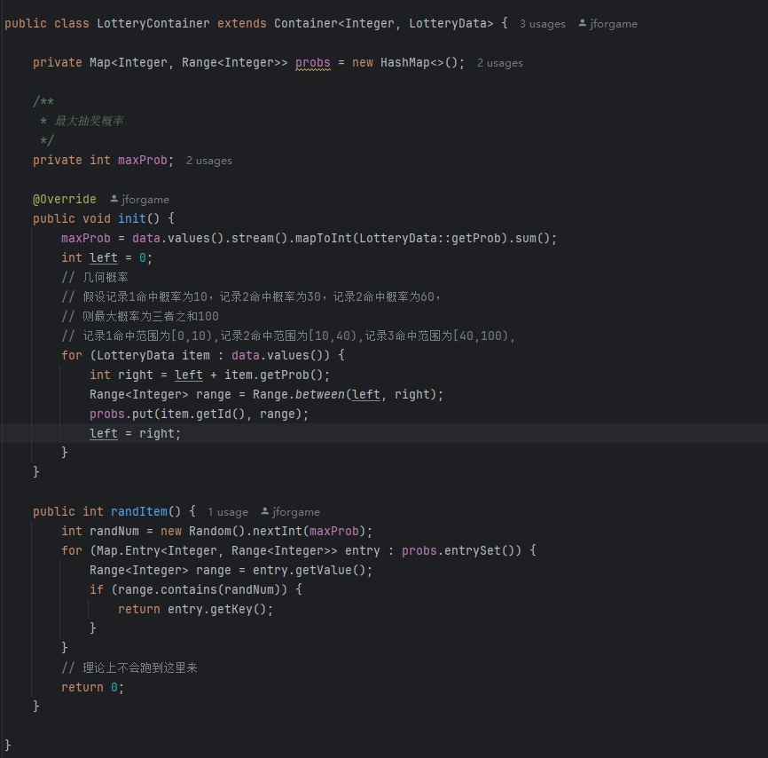

### Ⅰ. 简介

- jforgame-spring-boot-starter-data是一个用来解析测配配置的组件，支持csv/excel格式
  一个普通的java类就代表一份csv/excel配置，类的每个实例代表文件的每一行记录
- 无需申明配置的字段类型，自动根据javabean的定义进行转换
- 支持二级缓存，无需任何额外代码解决配置热更缓存一致性问题


### Ⅱ. 自动映射

- HEADER行以上的记录程序不会读写，策划可自行添加，例如增加注释，字段类型等等
- HEADER行标记每个字段的名称，程序从HEADER所在行的下一行开始读取
- 程序读取到END所在的行结束，END行下面，即使有数据，程序也不会读取

  

- Csv对应的Java类

  

  主要注解
- @DataTable 表明该类为配置类
- @Id 表明该自动为配置类的主键
- @Index 表明对该自动建立索引，相当于sql的group by分组  

### Ⅲ. 使用
- 组件引用
  ```
    <dependency>
        <groupId>io.github.jforgame</groupId>
        <artifactId>jforgame-spring-boot-starter-data</artifactId>
        <version>2.0.0</version>
    </dependency>
  ```    
- 项目配置（application.yml文件）
   ```
  jforgame:
    data:
      ## 配置表实体扫描目录
      tableScanPath: org.jforgame.server.game.database.config
      ## 二级缓存Container扫描目录
      containerScanPath: org.jforgame.server.game.database.config
  ```

- 二级缓存, 默认容器只保存id与实体的映射，索引与实体列表的映射，如果程序需要用到二级缓存，只需继承Container类即可  

  

- 配置获取
  1. 获取单条记录
  ```
      // 查询id=1的数据
      ItemData itemData = GameContext.dataManager.queryById(ItemData.class, 1);
  ```
  2. 获取分组索引数据
  ```
      // 查询type=1的所有分组数据
      List<ItemData> itemDataList = GameContext.dataManager.queryByIndex(ItemData.class, "type", 1);
  ```
  3. 获取二级缓存数据
  ```
      // 获取二级缓存数据
      QuestContainer container = GameContext.dataManager.queryContainer(QuestData.class, QuestContainer.class);
      Reward rewards = container.getRewardBy(1);
      System.out.println(JsonUtil.object2String(rewards));
  ```
  4. 配置热更
  ```
      for (String table : tables) {
          try {
              GameContext.dataManager.reload(table);
              succ.add(table);
          } catch (Exception e) {
              log.error("", e);
              failed.add(table);
          }
      }
      log.info("本次热更配置，成功为[{}],失败为[{}]", JsonUtil.object2String(succ), JsonUtil.object2String(failed));
  ```